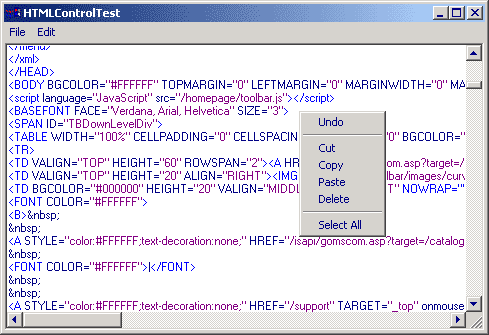



## HTML Control 1\.2 \(HTML color syntax highlighter\)

### Description

The reason why I created this is as follows:

Most of the HTML color syntax highlighters that

I have found here are either to big

complicated, slow or has other disadvantages.

Many of them allso required selveral .cls/.bas

files, witch makes them harder to implement in

existing projects.

So therefore I started on this with some

requirements in mind.

1. It had to one single .ctl file that could

easilly be dropped in the project explorer.

2. It should be simple to use with the fewest

amount of arguments as possible

3. I wanted it to have alle the basic functions

like: Undo, Cut, Copy, Paste, Delete

Select All

because theese are really boring to write

over and over again.

Thanks to RegX for his "FastHTML/XML Highlight"

I had the foundation of the highliting.

You can see his project here:

http://makeashorterlink.com/?J16C426F2

So here you have it.

1. Set a refference to

"Microsoft VBScript Regular Expressions 5.5"

in Project > Refferences

2. Copy "txtHTML.ct" and "txtHTML.ctx"to your

projects´s folder

3. Drop the txtHTML.ctl in your Project Explorer

4. Ready!

Oh yeh!

Remember that Votes = Good :o)

Update 06,Jan,2003

Fixed: crash when typing a comment at first.

Fixed: Not coloring correctly when typing tags inside a comment.
 
### More Info
 

             |
---                |---
**Submitted On**   |2003-01-05 00:30:44
**By**             |[Dondata](https://github.com/Planet-Source-Code/PSCIndex/blob/master/ByAuthor/dondata.md)
**Level**          |Intermediate
**User Rating**    |3.4 (17 globes from 5 users)
**Compatibility**  |VB 5\.0, VB 6\.0
**Category**       |[Custom Controls/ Forms/  Menus](https://github.com/Planet-Source-Code/PSCIndex/blob/master/ByCategory/custom-controls-forms-menus__1-4.md)
**World**          |[Visual Basic](https://github.com/Planet-Source-Code/PSCIndex/blob/master/ByWorld/visual-basic.md)
**Archive File**   |[HTML\_Contr152498162003\.zip](https://github.com/Planet-Source-Code/dondata-html-control-1-2-html-color-syntax-highlighter__1-42224/archive/master.zip)

